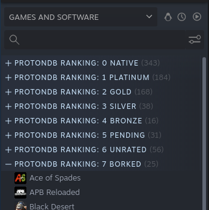

# ProtonDB-Tags [](https://github.com/CorruptComputer/ProtonDB-Tags/actions/workflows/tests.yml)

This is just a small python script to pull ratings from ProtonDB and import them into your Steam library as tags.

Here is a screenshot which shows how it looks once ran:



### Dependencies

This script requires Python 3, you can check your python version with `python --version`. If your default is Python 2 then you'll need to check with your distro's documentation and install Python 3, then replace all of the below commands with `python3` and `pip3`.

You'll need to install [vdf](https://github.com/ValvePython/vdf) and [requests](https://requests.readthedocs.io/en/latest/) before this can run.
You can install them via pip with:
```bash
pip install requests vdf
```

Alternatively you can use the included requirements.txt file:
```bash
pip install -r requirements.txt
```

### Running

**WARNING:** This may clear all of your current tags in Steam. You have been warned!

This can be simply run with: 
```bash
python ProtonDB-Tags.py
```

It will also ask before saving the file, so if you want to just test it out theres no real danger of overwriting anything.

By default this will not check the Steam API for native titles. This can be enabled with the `--check-native` flag. This will add a 1 second wait to each Steam API call, as without this you will get rate-limited. The script will build a cache of these as it runs, so after the first run it will go faster.

You can also specify a custom path to your `sharedconfig.vdf` with: 
```bash
python ProtonDB-Tags.py --sharedconfig /path/to/sharedconfig.vdf
```

The full command line options can be viewed with: 
```bash
python ProtonDB-Tags.py --help
```

### Contributing

All feedback is welcome and appreciated! Please make an issue if you have any ideas or feedback, I would love to hear them!

If you would like to make a PR all I ask is that you are also open to feedback on your written code. 
PRs should target the `dev` branch of the repo.

### Troubleshooting

If you are finding that not all of your games are being categorized try adding the `--fetch-games` flag to the script.
This will require you to provide a Steam API Key, and the script will walk you through getting it setup.
With this the script will be able to read the Steam API directly to pull a list of the games on your account.
Any games that are found to be missing from the local `sharedconfig.vdf` will be added there and should be categories as expected.

Please keep in mind that most Linux Native games will not be categorized without the `--check-native` flag, as ProtonDB doesn't return anything for them.

---

If you get an error which looks like this:
```
WARNING: This may clear your current tags on Steam!
Would you like to save sharedconfig.vdf? (y/N)y
Traceback (most recent call last):
  File "ProtonDB-Tags.py", line 220, in 
    main(arguments)
  File "ProtonDB-Tags.py", line 207, in main
    check = input("Would you like to save sharedconfig.vdf? (y/N)")
  File "", line 1, in 
    NameError: name 'y' is not defined
```
It means you ran the script with python2, please run it with python3. More info about why this error happens can be found [here](https://stackoverflow.com/a/21122817).

If anything else is not working you please feel free to open an issue here.
